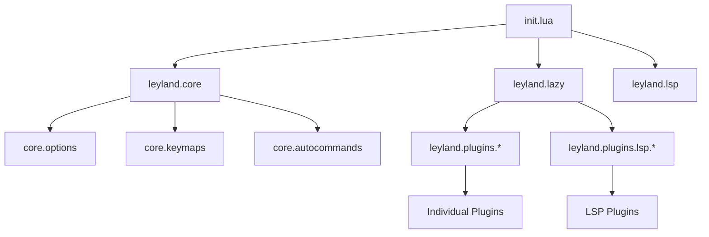

## Overview

nvim-luffy follows a modular Neovim configuration structure, organizing code into logical directories and leveraging Lua's module system for clean separation of concerns.

## Directory Tree

```
nvim-luffy/
├── init.lua                          # Entry point
├── lazy-lock.json                    # Plugin version lock file
└── lua/
    └── leyland/
        ├── core/                     # Core configuration
        │   ├── init.lua             # Loads all core modules
        │   ├── options.lua          # Vim options & settings
        │   ├── keymaps.lua          # Global keymaps
        │   └── autocommands.lua     # Autocommands & autocmds
        │
        ├── plugins/                  # Plugin configurations
        │   ├── init.lua             # Utility plugins
        │   ├── alpha.lua            # Dashboard/startup screen
        │   ├── autopairs.lua        # Auto-pairing brackets
        │   ├── colorscheme.lua      # Theme definitions
        │   ├── diffview.lua         # Git diff viewer
        │   ├── flash.lua            # Motion/jump plugin
        │   ├── formatting.lua       # Code formatting (conform.nvim)
        │   ├── harpoon.lua          # File navigation
        │   ├── neogit.lua           # Git interface
        │   ├── nvim-cmp.lua         # Completion engine
        │   ├── nvim-tree.lua        # File explorer
        │   ├── snacks.lua           # UI enhancements
        │   ├── telescope.lua        # Fuzzy finder
        │   ├── treesitter.lua       # Syntax parsing
        │   └── trouble.lua          # Diagnostics list
        │   └── lsp/                 # LSP-specific configs
        │       ├── lsp.lua          # LSP keymaps & setup
        │       └── mason.lua        # LSP/tool installer
        │
        ├── lazy.lua                  # Lazy.nvim plugin manager setup
        └── lsp.lua                   # LSP configuration loader
```

## Entry Point

<CodeGroup>
```lua init.lua
require("leyland.core")
require("leyland.lazy")
require("leyland.lsp")
```
</CodeGroup>

The main `init.lua` file loads three core modules in order:

<Steps>
  <Step title="Core Configuration">
    Loads editor options, keymaps, and autocommands from `lua/leyland/core/`
  </Step>
  
  <Step title="Plugin Manager">
    Initializes lazy.nvim and loads all plugin configurations
  </Step>
  
  <Step title="LSP Setup">
    Configures Language Server Protocol keymaps and diagnostics
  </Step>
</Steps>

## Module System

### How Require Works

nvim-luffy uses Lua's `require()` function to load modules:

<CodeGroup>
```lua Require Example
-- Loads lua/leyland/core/init.lua
require("leyland.core")

-- Loads lua/leyland/plugins/telescope.lua
require("leyland.plugins.telescope")
```
</CodeGroup>

<Note>
  The path separator is a dot (`.`) not a slash (`/`), and the `.lua` extension is omitted.
</Note>

### Core Module Loading

The `lua/leyland/core/init.lua` file loads all core components:

```lua
require("leyland.core.options")      -- Editor settings
require("leyland.core.keymaps")      -- Global keybindings
require("leyland.core.autocommands") -- Autocommands
```

### Plugin Module Loading

Lazy.nvim automatically imports plugins from specified directories:

```lua lua/leyland/lazy.lua
require("lazy").setup({
  { import = "leyland.plugins" },     -- Loads all lua/leyland/plugins/*.lua
  { import = "leyland.plugins.lsp" }  -- Loads all lua/leyland/plugins/lsp/*.lua
})
```

<Info>
  Each plugin file in these directories returns a table that configures the plugin using lazy.nvim's specification format.
</Info>

## Configuration Layers

### Layer 1: Core Settings

<Card title="lua/leyland/core/options.lua" icon="gear">
  Sets up fundamental Vim options like line numbers, indentation, search behavior, and clipboard integration.
</Card>

### Layer 2: Core Keymaps

<Card title="lua/leyland/core/keymaps.lua" icon="keyboard">
  Defines global keybindings that work across all buffers and modes.
</Card>

### Layer 3: Autocommands

<Card title="lua/leyland/core/autocommands.lua" icon="bolt">
  Sets up automatic behaviors like highlighting yanked text and clearing search highlights.
</Card>

### Layer 4: Plugin Manager

<Card title="lua/leyland/lazy.lua" icon="package">
  Configures lazy.nvim to manage plugin installation, updates, and loading.
</Card>

### Layer 5: Plugin Configurations

<Card title="lua/leyland/plugins/" icon="puzzle-piece">
  Individual plugin configuration files that define plugin specs, options, and plugin-specific keymaps.
</Card>

### Layer 6: LSP Setup

<Card title="lua/leyland/lsp.lua" icon="code">
  Configures LSP-specific keybindings and diagnostic display that activate when an LSP attaches to a buffer.
</Card>

## File Organization Principles

<AccordionGroup>
  <Accordion title="One plugin per file">
    Each plugin gets its own configuration file in `lua/leyland/plugins/`, making it easy to find and modify plugin settings.
  </Accordion>
  
  <Accordion title="Lazy loading by default">
    Plugins are configured with events, commands, and keys to load only when needed, improving startup time.
  </Accordion>
  
  <Accordion title="LSP separation">
    LSP-related plugins are isolated in `lua/leyland/plugins/lsp/` to keep server configurations organized.
  </Accordion>
  
  <Accordion title="Core vs Plugin keymaps">
    Global keymaps live in `core/keymaps.lua`, while plugin-specific keymaps are defined within their plugin configuration files.
  </Accordion>
</AccordionGroup>

## Adding New Components

<Tabs>
  <Tab title="Adding a Plugin">
    Create a new file in `lua/leyland/plugins/` that returns a lazy.nvim plugin spec:
    
    ```lua lua/leyland/plugins/my-plugin.lua
    return {
      "author/plugin-name",
      config = function()
        -- Plugin setup here
      end,
    }
    ```
    
    Lazy.nvim will automatically detect and load it.
  </Tab>
  
  <Tab title="Adding a Keymap">
    Add to `lua/leyland/core/keymaps.lua` for global keymaps:
    
    ```lua
    vim.keymap.set("n", "<leader>x", "<cmd>Command<CR>", { desc = "Description" })
    ```
    
    Or add within a plugin file for plugin-specific keymaps:
    
    ```lua
    keys = {
      { "<leader>x", "<cmd>Command<CR>", desc = "Description" },
    }
    ```
  </Tab>
  
  <Tab title="Adding an Autocommand">
    Add to `lua/leyland/core/autocommands.lua`:
    
    ```lua
    vim.api.nvim_create_autocmd("EventName", {
      group = vim.api.nvim_create_augroup("MyGroup", { clear = true }),
      callback = function()
        -- Action here
      end,
    })
    ```
  </Tab>
</Tabs>

## Module Dependencies



<Tip>
  The modular structure makes it easy to disable plugins by simply commenting out or deleting their configuration file.
</Tip>